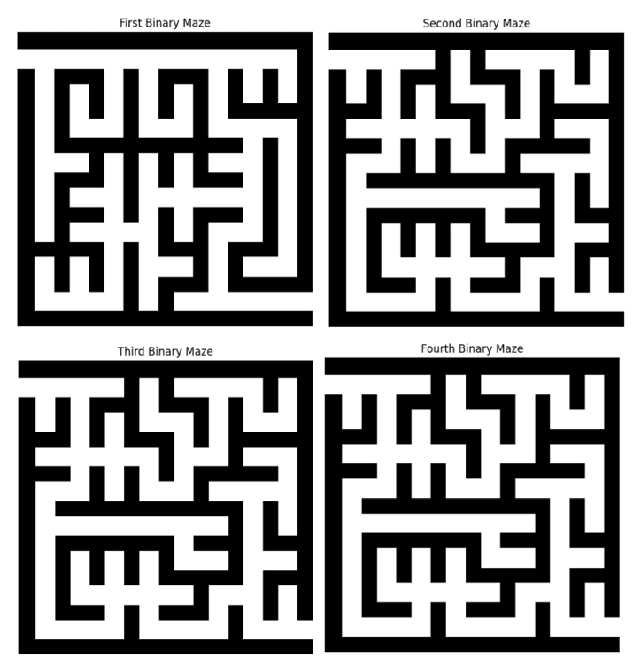
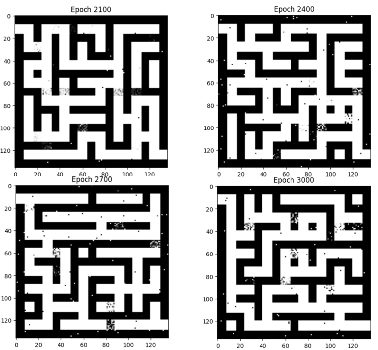
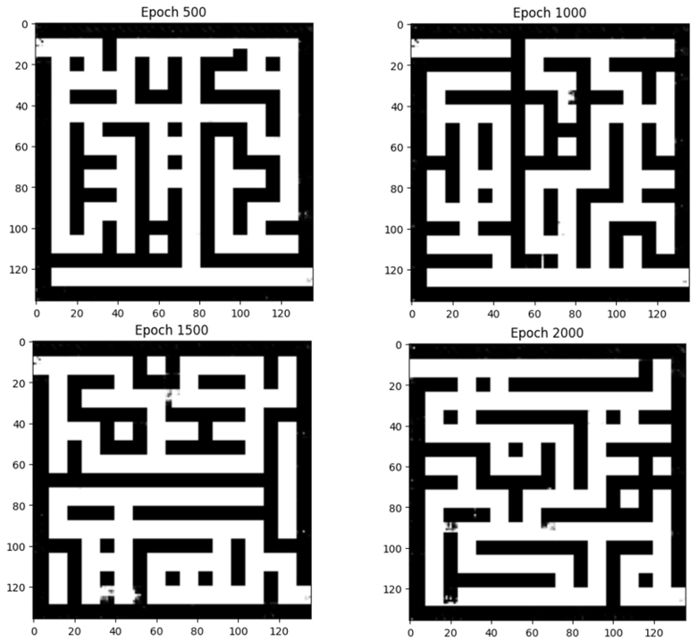
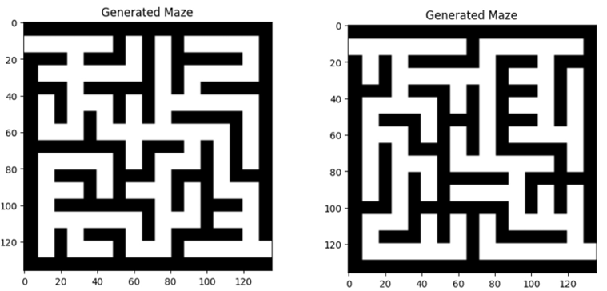

# Maze Generation with GANs and Deep Reinforcement Learning

A PyTorch-based project exploring **Generative Adversarial Networks (GANs)**, **Deep Convolutional GANs (DCGANs)**, and **Deep Q-Learning (DQN)** for maze generation.

This project demonstrates how generative deep-learning models and reinforcement-learning agents can be applied to structured spatial-generation problems while maintaining maze solvability.

## Overview

This project was originally developed for **ECE 651** and later refactored for reproducibility, code clarity, and portfolio presentation.

The workflow includes:

- Preparing a dataset of binary maze images
- Training a fully connected GAN for maze generation
- Training a DCGAN-style architecture to better capture spatial structure
- Developing a DQN-based maze generator
- Using explicit solvability checks during reinforcement-learning updates
- Exploring quantitative metrics for maze quality and complexity
- Designing a future DQN-based maze-solving framework

The project highlights both the strengths and limitations of GAN- and reinforcement-learning-based approaches to structured generation.

---

## Project Pipeline

The overall workflow is:

**Maze Dataset → Binary Representation → Fully Connected GAN → DCGAN → DQN Maze Generator → Evaluation & Future Maze-Solving Framework**

---

## 1. Maze Dataset

The original project generated approximately **1,000 maze examples** for training.

Each maze image is converted to a binary representation:

- `0` = walkable region
- `1` = wall

An important distinction is that the original logical maze may be described at a coarse grid level, while the PNG files used for neural-network training are rendered pixel images.

The refactored code therefore detects the actual image dimensions dynamically instead of assuming that every training matrix is 8×8.

### Example Training Mazes



These examples illustrate the structural diversity of the maze dataset used as the basis for generative modeling.

---

## 2. Fully Connected GAN

The first generative approach uses fully connected neural networks for both the generator and discriminator.

### Generator

The generator maps a latent random vector into a maze image:

```text
Latent Vector
    ↓
256
    ↓
512
    ↓
1024
    ↓
Maze Image
```

ReLU activations are used in the hidden layers and `Tanh` is used at the output.

### Discriminator

The discriminator flattens the maze image and classifies it as real or generated:

```text
Maze Image
    ↓
Flatten
    ↓
1024
    ↓
512
    ↓
128
    ↓
Real / Fake
```

LeakyReLU activations and dropout are used for regularization.

### Motivation

The fully connected GAN provides a relatively simple baseline and is useful for rapid prototyping.

However, because the maze is treated as a flattened vector, the architecture has limited ability to explicitly capture local spatial relationships.

### Generated Examples



The fully connected GAN can reproduce basic maze-like structures, but the generated outputs may show repetitive patterns or weaker spatial organization.

---

## 3. DCGAN-Style Maze Generator

The second configuration uses convolutional and transposed-convolutional layers.

The generator first projects the latent vector into a spatial feature representation and then upsamples it into a maze image.

The discriminator uses convolutional layers to extract spatial features directly from maze images.

### Advantages

Compared with the fully connected architecture, the DCGAN-style model is better suited to:

- Capturing local spatial patterns
- Learning wall/path structure
- Producing more complex maze layouts
- Representing two-dimensional image structure

### Generated Examples



The DCGAN-style architecture produced visually stronger spatial structure and more complex maze configurations than the fully connected baseline.

### Training Considerations

GAN training can be sensitive to:

- Random initialization
- Hyperparameter settings
- Generator/discriminator imbalance
- Training instability
- Random seed

The refactored notebook therefore includes explicit training-loss diagnostics and periodic model checkpoints rather than treating the minimum generator loss alone as a definitive measure of model quality.

---

## 4. DQN-Based Maze Generation

The project also explores maze generation as a reinforcement-learning problem using **Deep Q-Learning**.

Instead of generating an entire maze in one forward pass, the DQN iteratively modifies the maze while receiving rewards based on the resulting structure.

### State

The state is the flattened binary maze:

```text
0 = path
1 = wall
```

### Action Space

Each action corresponds to toggling one location:

```text
Wall → Path
Path → Wall
```

The start and goal locations are kept fixed.

### Solvability Constraint

A proposed action is checked using **Breadth-First Search (BFS)**.

If the proposed modification makes the maze unsolvable:

- The modification is rejected
- The previous maze is retained
- A negative reward is assigned

This prevents the DQN from improving its reward by generating invalid maze structures.

### Reward Design

The refactored DQN implementation uses the shortest valid path between the start and goal as part of the reward.

For a solvable maze:

```text
Reward ∝ shortest path length
```

Longer valid paths represent more challenging maze structures.

For an invalid or unsolvable proposed maze:

```text
Reward = negative penalty
```

This is more directly connected to maze complexity than simply counting the number of open cells.

### Generated Examples



The DQN-based approach treats maze generation as a sequential decision-making problem and explicitly preserves start-to-goal solvability during maze modification.

---

## 5. Maze Connectivity and Validation

The original project used connected-component analysis during preprocessing.

The refactored code makes an important distinction:

> A single connected walkable component does not necessarily imply that a logical maze has a unique solution.

Therefore, the implementation uses more precise terminology:

- **Connected-component analysis** for image-level connectivity
- **BFS shortest-path search** for explicit start-to-goal solvability

This distinction improves the interpretation of maze validity.

---

## 6. DQN Architecture

The DQN uses a fully connected neural network:

```text
Flattened Maze State
        ↓
       128
        ↓
       128
        ↓
Q-value for each possible action
```

Training includes:

- Experience replay
- Target network
- Epsilon-greedy exploration
- Adam optimization
- Discounted future rewards
- Periodic target-network updates

---

## 7. Reinforcement Learning Training Strategy

The cleaned implementation includes:

- Replay-buffer capacity of up to 10,000 transitions
- Mini-batch training
- Epsilon-greedy exploration
- Discount factor for future rewards
- Separate target and online networks
- Solvability-preserving environment transitions
- Fixed episode lengths
- Training diagnostics

The DQN target calculation is performed without gradient propagation through the target network.

---

## 8. Maze-Solving Framework

The original project also considered a DQN-based maze-solving agent.

The uploaded source notebook does not contain a separate complete training implementation for this solver, so the portfolio version treats maze solving as a **designed extension rather than a completed trained model**.

A future maze-solving environment could use:

### State

```text
Maze structure + current agent position
```

### Actions

```text
Up
Down
Left
Right
```

### Example Rewards

```text
+10   Reach the goal
-0.1  Each movement step
Penalty for invalid movement
```

### Evaluation

Potential evaluation metrics include:

- Maze-solving success rate
- Number of steps required
- Shortest-path efficiency
- Generalization to unseen mazes

---

## 9. Suggested Evaluation Metrics

Visual inspection alone is not sufficient for evaluating generated mazes.

Useful quantitative measures include:

### Solvability Rate

Percentage of generated mazes containing a valid start-to-goal path.

### Shortest-Path Length

Measures the difficulty of navigating the generated maze.

### Wall / Path Balance

Helps identify degenerate outputs such as nearly empty or nearly solid mazes.

### Structural Diversity

Possible measures include pairwise binary-image or Hamming-distance comparisons among generated mazes.

### Dead-End Structure

The number or proportion of dead ends can be used as another measure of maze complexity.

### Seed Sensitivity

Repeating experiments across multiple random seeds can help quantify model stability.

---

## 10. Key Technical Improvements

The portfolio version of the code was refactored from the original course notebook.

Major improvements include:

- Replacing hard-coded Google Drive paths with relative project paths
- Detecting maze-image dimensions dynamically
- Separating image connectivity from unique-solution claims
- Consolidating duplicate GAN training code
- Creating reusable training functions
- Adding generator/discriminator loss diagnostics
- Saving periodic and final model checkpoints
- Improving DQN state and environment definitions
- Selecting valid walkable start and goal locations
- Using BFS shortest-path length in the reward function
- Penalizing and rejecting unsolvable DQN actions
- Preventing gradient propagation through the DQN target network
- Adding reproducibility controls
- Adding clearer documentation and code comments

---

## Running the Project

### 1. Clone the repository

```bash
git clone https://github.com/ycwang179/maze-generation-gan-drl.git
cd maze-generation-gan-drl
```

### 2. Install dependencies

```bash
pip install -r requirements.txt
```

### 3. Open the notebook

```bash
jupyter notebook maze_generation_gan_drl.ipynb
```

You can also open the notebook directly in JupyterLab, VS Code, or another compatible environment.

---

## Training Controls

Full deep-learning training can require substantial computation.

For that reason, model training is disabled by default in the cleaned notebook.

```python
RUN_FC_GAN = False
RUN_DCGAN = False
RUN_DQN = False
```

To run a model, change the corresponding flag:

```python
RUN_FC_GAN = True
```

or:

```python
RUN_DCGAN = True
```

or:

```python
RUN_DQN = True
```

Training time depends on the available CPU/GPU hardware and the selected number of epochs.

---

## Dataset

The complete generated maze-image dataset is not included in this repository because of file size.

The code supports the following structure:

```text
data/
├── training_images/
└── binary_mazes.npy
```

If `binary_mazes.npy` already exists, the notebook loads it directly.

Otherwise, maze PNG files can be placed under:

```text
data/training_images/
```

and converted into the binary NumPy dataset.

---

## Repository Structure

```text
maze-generation-gan-drl/
│
├── maze_generation_gan_drl.ipynb
├── maze_generation_gan_drl.py
├── requirements.txt
│
└── assets/
    ├── training_mazes.png
    ├── fc_gan_generated.png
    ├── dcgan_generated.png
    └── dqn_generated.png
```

### `maze_generation_gan_drl.ipynb`

Main documented notebook containing:

- Data preparation
- Connectivity validation
- Fully connected GAN
- DCGAN
- DQN maze generator
- Reinforcement-learning diagnostics
- Evaluation recommendations

### `maze_generation_gan_drl.py`

Python source version of the refactored implementation.

### `requirements.txt`

Python package dependencies required to run the project.

### `assets/`

Contains selected training and generated-maze visualizations used in this README.

---

## Technology Stack

- Python
- PyTorch
- NumPy
- SciPy
- Pillow
- Matplotlib
- Deep Learning
- Generative Adversarial Networks
- DCGAN
- Deep Q-Learning
- Reinforcement Learning
- Breadth-First Search

---

## Project Highlights

This project demonstrates experience with:

- Generative AI
- GAN architecture design
- Convolutional neural networks
- Deep reinforcement learning
- DQN implementation
- Experience replay
- Target networks
- Reward-function design
- Graph-search algorithms
- Simulation environments
- Model reproducibility
- GPU-based deep-learning workflows
- Refactoring research code for reproducibility

---

## Limitations and Future Work

Several extensions could strengthen the project further:

- Evaluate generated mazes using standardized quantitative metrics
- Repeat GAN training across multiple random seeds
- Explore more stable GAN objectives such as Wasserstein GAN variants
- Compare GAN-generated and DQN-generated mazes quantitatively
- Train models directly on logical maze grids rather than rendered images
- Scale experiments to larger maze sizes
- Implement and evaluate a complete DQN navigation agent
- Compare DQN navigation with classical algorithms such as BFS and A*
- Evaluate generalization on unseen maze distributions

---

## Project Purpose

This project demonstrates an end-to-end experimental AI workflow:

**Data Generation → Representation → Generative Modeling → Reinforcement Learning → Validation → Evaluation**

The emphasis is on combining generative deep learning with sequential decision-making while maintaining structural constraints such as maze solvability.

---

## Author

**Yu-Chun Wang**  
Ph.D. in Statistical Science  
George Mason University
